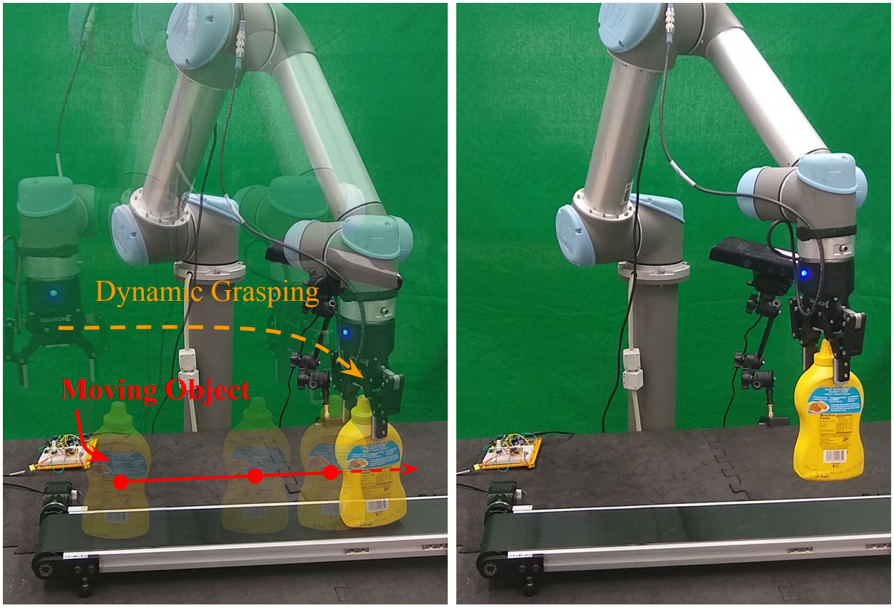

# Dynamic Grasping with Reachability and Motion Awareness

[Iretiayo Akinola\*](http://www.cs.columbia.edu/~iakinola/), [Jingxi Xu\*](https://jxu.ai/), [Shuran Song](https://www.cs.columbia.edu/~shurans/), and [Peter Allen](https://www.cs.columbia.edu/~allen/) (\* equal contribution)

Columbia University, New York, NY, United States

[International Conference on Intelligent Robots and Systems (IROS) 2021](https://www.iros2021.org/)

[Project Page](http://crlab.cs.columbia.edu/dynamic_grasping/) | [Video (15min, IROS presentation)](https://youtu.be/KPsjytWk07s) | [Video (1min)](https://youtu.be/hP1aSd1YDq8) | [Arxiv](https://arxiv.org/abs/2103.10562)

</div>

<div>

Grasping in dynamic environments presents a unique set of challenges. A stable and reachable grasp can become unreachable and unstable as the target object moves, motion planning needs to be adaptive and in real time, the delay in computation makes prediction necessary. In this paper, we present a dynamic grasping framework that is reachability-aware and motion-aware. Specifically, we model the reachability space of the robot using a signed distance field which enables us to quickly screen unreachable grasps. Also, we train a neural network to predict the grasp quality conditioned on the current motion of the target. Using these as ranking functions, we quickly filter a large grasp database to a few grasps in real time. In addition, we present a seeding approach for arm motion generation that utilizes solution from previous time step. This quickly generates a new arm trajectory that is close to the previous plan and prevents fluctuation. We implement a recurrent neural network (RNN) for modelling and predicting the object motion. Our extensive experiments demonstrate the importance of each of these components and we validate our pipeline on a real robot.

This repository contains code for running and evaluating our dynamic grasping algorithms in the PyBullet simulator with Mico arm or UR5 arm with Robotiq gripper. It also provides brief instructions and guidelines for running on a real robot. If you find the codebase useful, please consider citing as below. If you have any questions, please contact [me](https://jxu.ai/) at `jxu [at] cs [dot] columbia [dot] edu`.

```
@article{akinola2021dynamic,
  title={Dynamic Grasping with Reachability and Motion Awareness},
  author={Akinola, Iretiayo and Xu, Jingxi and Song, Shuran and Allen, Peter K},
  journal={International Conference on Intelligent Robots and Systems (IROS) 2021},
  year={2021}
}
```

## Table of Contents
- [Dependencies](#dependencies)
- [Simulation](#simulation)
  - [Setup](#setup)
  - [Start MoveIt! Motion Planner](#start-moveit-motion-planner)
  - [Run Dynamic Grasping](#run-dynamic-grasping)
  - [Print Statistics](#print-statistics)
  - [Evaluate Dynamic Grasping On Multiple Objects Using Shell Script](#evaluate-dynamic-grasping-on-multiple-objects-using-shell-script)
  - [Evaluate Dynamic Grasping on Multiple Tasks Using Shell Script](#evaluate-dynamic-grasping-on-multiple-tasks-using-shell-script)
- [Real Robot](#real-robot)

## Dependencies

This code has been tested on Ubuntu 18.04 and [ROS Melodic](http://wiki.ros.org/melodic). Make sure you have [ROS Melodic](http://wiki.ros.org/melodic), [gitman](https://gitman.readthedocs.io/en/latest/) installed.

Installing gitman on Ubuntu 18.04 can be tricky because the default python version is 2.7. We recommend follow the below instructions to install gitman.

```
python3 -m pip install --user pipx
python3 -m pipx ensurepath
python3 -m pipx gitman
```

Install some dependencies for GraspIt!.

```
sudo apt-get install -y libqt4-dev libqt4-opengl-dev \
libqt4-sql-psql libcoin80-dev libsoqt4-dev libblas-dev \
liblapack-dev libqhull-dev \
ros-melodic-grasping-msgs
```

Follow the instructions [here](https://github.com/graspit-simulator/graspit_interface#graspit-setup) to install GraspIt!.

Install some prerequisite ROS packages.

```
sudo apt install ros-melodic-trac-ik-kinematics-plugin \
ros-melodic-tf-conversions \
ros-melodic-ur-client-library
```

Install some prerequisite Python packages.
```
pip install pybullet numpy trimesh scikit-fm pandas tqdm plyfile shapely pyquaternion torch
```

## Simulation

</div>

<div>

### Setup

Clone this repository on your computer, gitman install necessary ROS packages and then build this workspace.

```
git clone git@github.com:jingxixu/dynamic_grasping.git
cd dynamic_grasping
gitman install
source /opt/ros/melodic/setup.bash
catkin config --extend /opt/ros/melodic --cmake-args -DCMAKE_BUILD_TYPE=Release
catkin build
```

**NOTE**: You might need to do the following modifications suggested by the error message during the build process, depending on some of the ROS package versions. In file `src/ur5_robotiq_meta_package/Universal_Robots_ROS_Driver/ur_calibration/src/calibration_consumer.cpp` and `src/ur5_robotiq_meta_package/Universal_Robots_ROS_Driver/ur_robot_driver/src/hardware_interface.cpp`, change `LOG_INFO` to `ROS_INFO`. Also, depending on your `xacro` package version, if you come across errors from running `xacro` in the build process, you might need to change all `__kinematics` to `kinematics` in `src/ur5_robotiq_meta_package/universal_robot/ur_description/urdf/ur5.urdf.xacro`.


Automatically install more ROS dependencies.
```
rosdep install --from-paths src --ignore-src -r -y
```

We need to `cd` into `src/dynamic_grasping_pybullet`, which is our main working directory.

```
cd src/dynamic_grasping_pybullet
```

We need to build [IKFastPy](https://github.com/andyzeng/ikfastpy).

```
cd ikfastpy
python setup.py build_ext --inplace
cd ..
```

As this project uses ROS, always remember to source the workspace setup shell script. This action needs to be done every time a new terminal tab is opened.
```
source ../../devel/setup.bash
```

### Start MoveIt! Motion Planner

Now we have everything ready to go, first start the MoveIt! motion planner for the UR5 arm + Robotiq gripper.

```
roslaunch launch/ur5_robotic_moveit_ros.launch planner:=ompl
```

If you want to start the planner for Mico arm instead, run

```
roslaunch launch/mico_moveit_ros.launch planner:=ompl
```

The below errors (if shows up) can be ignored and they won't affect the motion planning.

```
[ERROR] [1637358102.895304189]: No sensor plugin specified for octomap updater 0; ignoring.
[ERROR] [1637358102.932406993]: Could not find the planner configuration 'None' on the param server
```

### Run Dynamic Grasping

After the motion planner has started, we can start running `run_dynamic_with_motion.py`. An example of running the UR5 + Robotiq hand is as below,

```
  python run_dynamic_with_motion.py \
    --motion_mode dynamic_linear \
    --object_name bleach_cleanser \
    --robot_config_name ur5_robotiq \
    --num_trials 100 \
    --result_dir debug \
    --grasp_database_path assets/grasps/filtered_grasps_noise_robotiq_100 \
    --baseline_experiment_path assets/benchmark_tasks/ur5_robotiq/linear_obstacles/ \
    --grasp_threshold 0.1 \
    --lazy_threshold 30.3 \
    --conveyor_speed 0.03 \
    --close_delay 0.5 \
    --back_off -0.075 \
    --distance_low 0.3 \
    --distance_high 0.7 \
    --pose_freq 5 \
    --use_previous_jv \
    --use_seed_trajectory \
    --use_reachability \
    --use_motion_aware \
    --motion_aware_model_path assets/motion_aware_models/ur5_robotiq \
    --max_check 10 \
    --use_box \
    --use_kf \
    --always_try_switching \
    --fix_motion_planning_time 0.14 \
    --fix_grasp_ranking_time 0.135 \
    --rendering
```

`run_dynamic_with_motion.py` can take in a lot of different arguments. See [`run_dynamic_with_motion.py`](src/dynamic_grasping_pybullet/run_dynamic_with_motion.py) for a complete list. Here we explain some of the important arguments for evaluating our dynamic grasping pipeline.

| Arguments | Explanation |
|:---:|:---:|
| `motion_mode` | What motion mode the target object trajectory should be. It can be one of  `dynamic_linear` ,  `dynamic_linear_vary_speed` ,  `dynamic_sinusoid` , or  `dynamic_circular`. |
| `object_name` | This is the object we are evaluating on. It can be one of  `bleach_cleanser` ,  `mustard_bottle` ,  `potted_meat_can` ,  `sugar_box` ,  `tomato_soup_can` ,  `cube` ,  `power_drill` . |
| `robot_config_name` | What robot we are evaluating on. It can be  `ur5_robotiq`  or  `mico`. |
| `num_trials` | Number of trials to run. |
| `result_dir` | The output directory name to save the result csv files. |
| `grasp_database_path` | The database folder path, it should be  `assets/grasps/filtered_grasps_noise_robotiq_100`  for UR5 + Robotiq gripper or  `assets/grasps/filtered_grasps_noise_mico_100` for the Mico arm` . |
| `grasp_threshold` | Threshold for executing the grasp. Difference between the current arm joint values and planned pre-grasp joint values should all be smaller than this threshold for the robot to be allowed to grasp. |
| `lazy_threshold` | Threshold for starting motion replanning. Distance between the end-effector position and the planned pre-grasp position should be smaller than the threshold for motion replanning. |
| `conveyor_speed` | The speed of the object. |
| `close_delay` | When the robot starts executing the grasp, moving from pre-grasp pose to grasp pose, at what point should the robot start closing its hand. 0.5 means in the middle of the approach trajectory. |
| `back_off` | The distance of backing off between the pre-grasp pose and grasp pose. |
| `distance_low` | The closest distance to the robot base the sampled trajectory could be. |
| `distance_high` | The furthest distance to the robot base the sampled trajectory could be. |
| `baseline_experiment_path` | You can provide a path to a benchmark experiment folder. If this is provided, instead of randomly sampling the target object trajectory for each trial, it loads the trajectory parameters from the experiment folder. This makes the results reproducible and comparable for different variants of dynamic grasping algorithm. |
| `use_reachability` | Whether to use reachability-aware grasp planning. |
| `use_seed_trajectory` | Whether to use trajectory seeding. |
| `use_motion_aware` | Whether to use motion-aware grasp planning. |
| `motion_aware_model_path` | The path to the pre-trained motion-aware quality models. Should be  `assets/motion_aware_models/ur5_robotiq`  for UR5 arm + Robotiq hand or  `assets/motion_aware_models/mico`  for the Mico arm. |
| `use_previous_jv` | Whether to keep previous joint velocity instead of coming to a stop when motion is replanned. |
| `max_check` | How many grasps we would like to include in our filtered grasp dataset. If use both reachability and motion-aware grasp planning, we will keep the top  `max_check`  / 2 grasps for both reachability and motion-aware. |
| `use_box` | Whether to use a box to approximate the obstacle meshes. |
| `use_kf` | Whether to use Kalman Filter motion predictor. |
| `always_try_switching` | Whether to always plan a new grasp even though the old grasp remains feasible. |
| `fix_motion_planning_time` | Maximum grasp motion planning time budget. |
| `fix_grasp_ranking_time` | Maximum grasp ranking time budget. |
| `load_obstacles` | Whether to load obstacles surrounding the trajectory. |
| `add_top_shelf` | Whether to add a top shelf covering the linear trajectory. |
| `rendering` | Whether to start the GUI for visualization. Opening the GUI will drastically slow down the experiments. |

### Print Statistics

You can check progress and print some statistics using the below command.

```
python evaluate_dynamic_with_motion.py --result_dir debug
```

You should expect some output similar to

```
{
    "power_drill": {
        "dynamic_grasping_time": 8.292727272727276, 
        "num_grasp_switched": 4.838383838383838, 
        "num_successes": 92, 
        "dynamic_grasping_time_success_only": 7.9884782608695675, 
        "num_ik_called": 18.78038041411579, 
        "success_rate": 0.9292929292929293, 
        "num_trials": 99
    }, 
    "summary": {
        "dynamic_grasping_time": 8.292727272727276, 
        "num_grasp_switched": 4.838383838383838, 
        "num_successes": 92, 
        "dynamic_grasping_time_success_only": 7.9884782608695675, 
        "num_ik_called": 18.78038041411579, 
        "success_rate": 0.9292929292929293, 
        "num_trials": 99
    }
}

```

### Evaluate Dynamic Grasping On Multiple Objects Using Shell Script

To make life easier for everyone, we wrote a single shell script to spin up everything (including the MoveIt! planner and the python script). Under the hood, it is using the `screen` command. This script will evaluate `run_dynamic_with_motion.py` on all 7 objects in serial (starting another one after the previous one is finished). For UR5 + Robotiq gripper, run

```
./run_single_ur5.sh
```

For Mico arm, run

```
./run_single_mico.sh
```

These two shell scripts are also populated with default argument values. You can overwrite any of them by for example,

```
./run_single_mico.sh \
  --exp_name mico_ma_linear_ob \
  --motion_mode dynamic_linear \
  --use_reachability false \
  --use_motion_aware true \
  --baseline_experiment_path assets/benchmark_tasks/mico/linear_tasks_mico \
  --conveyor_speed 0.03 \
  --load_obstacles true;
```

### Evaluate Dynamic Grasping on Multiple Tasks Using Shell Script

We have provided a shell script for evaluating our dynamic grasping algorithm on multiple tasks in serial. When you run this script, it will iterate through all tasks as indicated in Table I in the paper by calling `run_single_ur5.sh` or `run_single_mico.sh` with various arguments. For UR5 + Robotiq gripper, run

```
./run_multiple_ur5.sh
```

For Mico arm, run

```
./run_multiple_mico.sh
```

## Real Robot
</div>

<div>

We will not provide the complete codebase to entirely reproduce our real robot experiments. At the point of publication, we lost access to many hardwares and versions of softwares we were using. Instead, we will give brief guidelines to implement the dynamic grasping algorithm on a real robot according to how we implemented it.

- Camera: Microsoft Kinect v1
- Conveyor belt: [Amazon link](https://www.amazon.com/DOBOT-Conveyor-Belt-Simplest-Production/dp/B073NXVW1H/ref=sr_1_5?keywords=conveyor+belt&qid=1637360049&sr=8-5)
- UR5 control: Official UR5 package and modified version of MoveIt!
- Pose estimation: [DOPE](https://github.com/NVlabs/Deep_Object_Pose)

